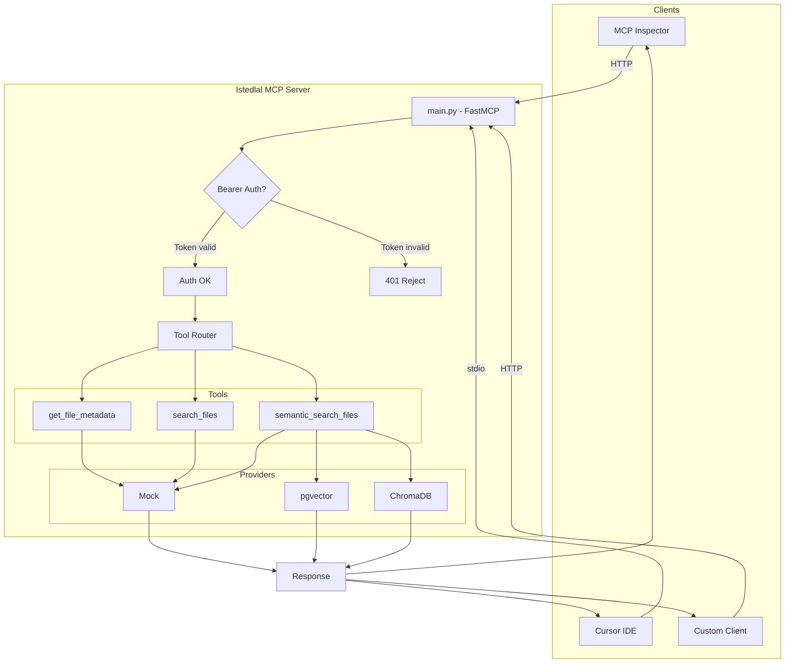
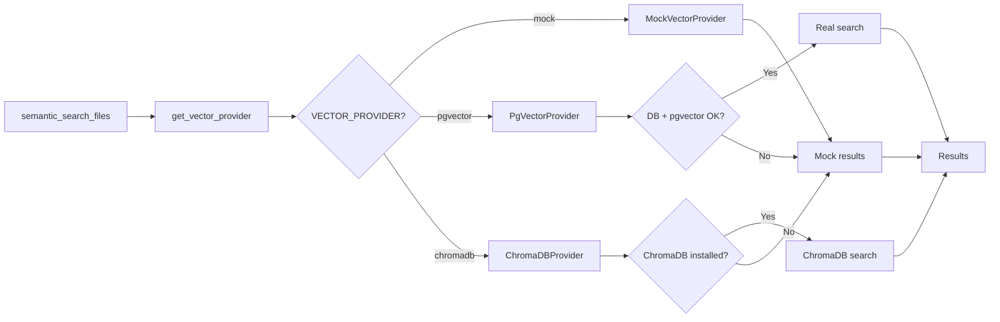
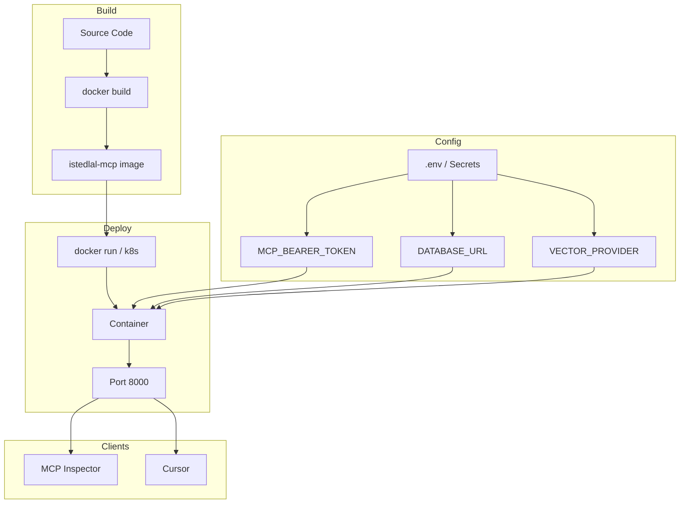

# Istedlal MCP Server – Workflow Diagrams

---

## 1. Request Flow (End-to-End)

```
┌─────────────────┐     ┌──────────────────┐     ┌─────────────────┐
│ MCP Inspector   │     │ Cursor IDE       │     │ Custom Client   │
│ (HTTP)          │     │ (stdio)          │     │ (HTTP)          │
└────────┬────────┘     └────────┬─────────┘     └────────┬────────┘
         │                       │                        │
         │    http://host:8000/mcp    stdio
         └───────────────────────┬────────────────────────┘
                                 │
                                 ▼
                    ┌────────────────────────┐
                    │   src/main.py          │
                    │   FastMCP Server       │
                    └────────────┬───────────┘
                                 │
              ┌──────────────────┼──────────────────┐
              │                  │                  │
              ▼                  ▼                  ▼
     ┌────────────────┐ ┌───────────────┐ ┌──────────────────┐
     │ GET /          │ │ Bearer Auth?  │ │ MCP Tool Call    │
     │ (root info)    │ │ (if token set)│ │ (JSON-RPC)       │
     └───────┬────────┘ └───────┬───────┘ └────────┬─────────┘
             │                  │ 401 if invalid   │
             │                  │                  │
             ▼                  ▼                  ▼
     ┌────────────────┐ ┌───────────────┐ ┌──────────────────┐
     │ JSON Response  │ │ Reject        │ │ Route to Tool     │
     │ status, tools  │ │               │ │ get_file_metadata │
     └────────────────┘ └───────────────┘ │ search_files      │
                                          │ semantic_search   │
                                          └────────┬─────────┘
                                                   │
                                                   ▼
                                          ┌──────────────────┐
                                          │ src/tools/       │
                                          │ Tool logic       │
                                          └────────┬─────────┘
                                                   │
                                                   ▼
                                          ┌──────────────────┐
                                          │ Provider/DB      │
                                          │ (mock/pgvector/  │
                                          │  chromadb)       │
                                          └────────┬─────────┘
                                                   │
                                                   ▼
                                          ┌──────────────────┐
                                          │ JSON Response    │
                                          │ → Client         │
                                          └──────────────────┘
```

---

## 2. Mermaid Diagram (Request Flow)



---

## 3. Vector Provider Selection Flow



---

## 4. Component Architecture

```
┌─────────────────────────────────────────────────────────────────────────┐
│                         Istedlal MCP Server                              │
├─────────────────────────────────────────────────────────────────────────┤
│                                                                          │
│  ┌─────────────┐    ┌─────────────┐    ┌─────────────────────────────┐  │
│  │   config    │    │    auth     │    │         tools               │  │
│  │  .env vars  │    │ Bearer      │    │  get_file_metadata          │  │
│  │             │    │ token verify│    │  search_files               │  │
│  └──────┬──────┘    └──────┬──────┘    │  semantic_search_files      │  │
│         │                  │           └──────────────┬──────────────┘  │
│         │                  │                          │                 │
│         └──────────────────┼──────────────────────────┘                 │
│                            │                                            │
│                            ▼                                            │
│  ┌──────────────────────────────────────────────────────────────────┐   │
│  │                     main.py (FastMCP)                             │   │
│  │  • Transport: stdio | streamable-http                             │   │
│  │  • Routes: /, /favicon.ico, /mcp                                  │   │
│  │  • All hosts allowed (Bearer auth for security)                   │   │
│  └──────────────────────────────────────────────────────────────────┘   │
│                            │                                            │
│                            ▼                                            │
│  ┌──────────────────────────────────────────────────────────────────┐   │
│  │              providers/vector (pluggable)                         │   │
│  │  ┌──────────┐   ┌──────────┐   ┌──────────┐                      │   │
│  │  │  mock    │   │ pgvector │   │ chromadb │                      │   │
│  │  │ (default)│   │ (Postgres)│   │ (local)  │                      │   │
│  │  └──────────┘   └──────────┘   └──────────┘                      │   │
│  └──────────────────────────────────────────────────────────────────┘   │
│                                                                          │
└─────────────────────────────────────────────────────────────────────────┘
```

---

## 5. Deployment Flow



---

**Note:** Mermaid diagrams GitHub, GitLab, VS Code (Markdown Preview), aur Cursor mein render ho sakte hain.
